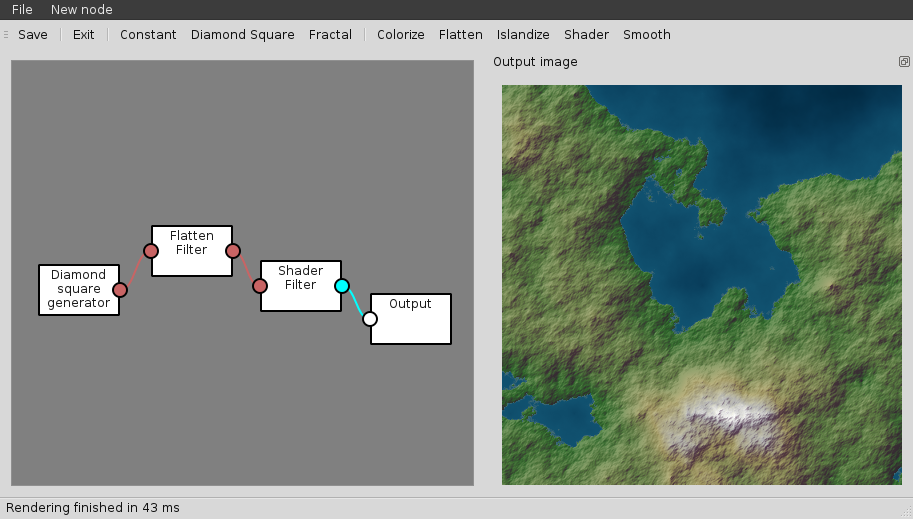

# MapMaker GUI
A small GUI to generate maps using the [MapMaker library](https://github.com/jube/mapmaker).

## Screenshot

## Building
Edit the location of MapMaker in [mmgui.pro](./mmgui.pro). Then simply run

    qmake
    make

## TODO
* Mutiple outputs
* Textual outputs
* Default scene
* Complete generators
* Complete filters
* Improve initial positioning of nodes
* Ensure memory sanity
* Realtime update when changing settings
    * might be too expensive?
    * turn on/off according to map size/computation time?
* Size independant?
* Configurable color ramp for the colorize filter
* Improve output display size handling

## Authors
- Yoann Blein
